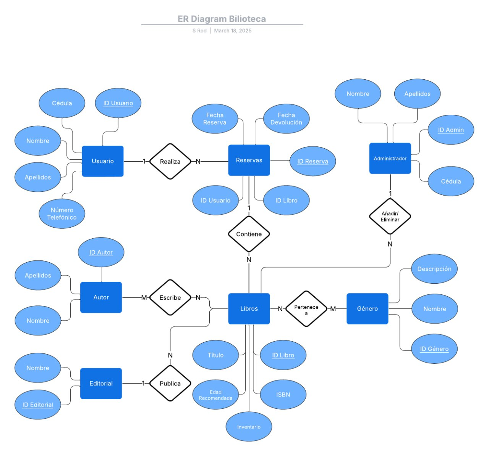

#Proyecto 1 BDII I 2025

Descripción de la Empresa
La propuesta se basa en una página en línea para mejorar el acceso y la gestión de recursos bibliográficos. Esta plataforma digital permite a los usuarios consultar la disponibilidad de los libros y reservarlos de forma remota.
Proceso de Negocio
    Consulta de Disponibilidad de Libros
        Usuarios: Los usuarios pueden acceder a la página en línea y buscar libros a reservar.
        Sistema: El sistema muestra la disponibilidad actual de cada libro.

    Reserva de Libros
        Usuarios: Los usuarios registrados pueden seleccionar los libros que desean reservar.
        Sistema: El sistema verifica la disponibilidad y permite al usuario realizar la reserva, asignando el libro al usuario y actualizando el estado del libro a "reservado".

    Gestión de Libros por Administradores
        Administradores: Los administradores de la biblioteca tienen acceso a funcionalidades avanzadas para gestionar el inventario de libros, la disponibilidad y los géneros existentes.
